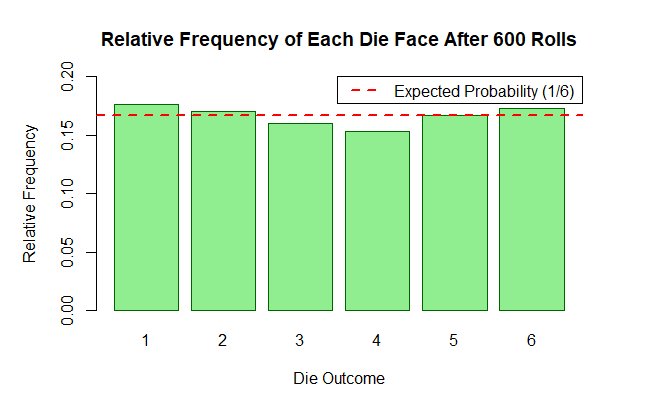

# Formative Assessment 2

# Question 3
___

An experiment consists of rolling a die. Use R to simulate this experiment 600 times and obtain the relative frequency of each possible outcome. Hence, estimate the probability of getting each of 1, 2, 3, 4, 5, and 6.

### Step 1: Simulating 600 rolls of a die

```r
set.seed(123)
```
```r
die_rolls <- sample(1:6, size = 600, replace = TRUE)  
```

### Step 2: Calculating the relative frequency for each outcome
```r
relative_frequency <- table(die_rolls) / 600
```

### Print the relative frequencies
```r
print(relative_frequency)
```

### Step 3: Visualizing the relative frequencies with a bar plot
```r
par(mar = c(5, 5, 4, 4))

# Creating the barplot
barplot(relative_frequency, 
        main = "Relative Frequency of Each Die Face After 600 Rolls", 
        xlab = "Die Outcome", 
        ylab = "Relative Frequency", 
        col = "lightgreen", 
        border = "darkgreen", 
        ylim = c(0, 0.2))  

# Adding the horizontal reference line for the expected probability (1/6)
abline(h = 1/6, col = "red", lwd = 2, lty = 2)

# Adding a legend in the top-right corner for easy interpretation
legend("topright", 
       legend = "Expected Probability (1/6)", 
       col = "red", 
       lty = 2, 
       lwd = 2,
       y.intersp = 0.4)

```


**Figure 1:** *Relative Frequency Distribution of Die Rolls Over 600 Trials*

Figure 1 shows the relative frequency of each six-sided die after 600 rolls. The relative frequencies are compared to the expected probability for each outcome, shown as the red dashed line at $1/6$ or approximately about 0.1667. The observed frequencies of each face change slightly. There are slight positive values for the die faces 1, 2, and 6 and a slight negative value for die faces 3, 4, and 5. In the finite sample size, these minor deviations are within expectations for random fluctuation.

In conclusion, the distribution appears uniform and points neither in the direction of some sort of intrinsic bias in the die nor suggests any such possibility. The random variations from the predicted probability can be attributed to natural randomness; the results fall in line with the assumption of a fair die.

