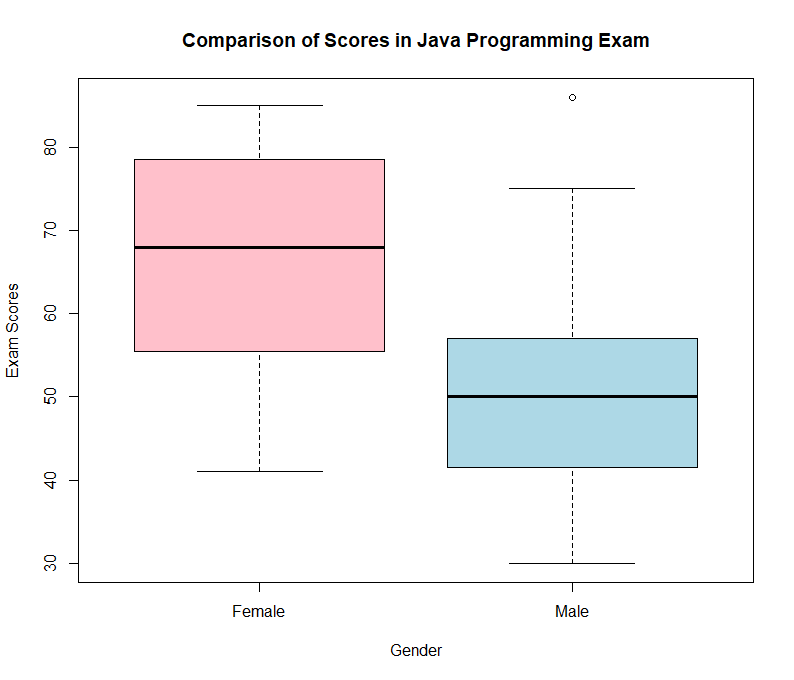

# Formative Assessment 1
**Authors:**

MERCADO, CONSUELO B.

SINOCRUZ, ARVIE M. 

2025-02-01

____

**Github Link:**
<https://github.com/eivra-sm/APM1110/blob/main/SEC%201-FA%201%20Group%203%20-%20MERCADO,%20C;%20SINOCRUZ,%20A%20-%20FA1.md>
____

# Question 1

1\. Write the skewness program, and use it to calculate the skewness
coefficient of the four examination subjects in results.txt
(results.csv). What can you say about these data?

Pearson has given an approximate formula for the skewness that is easier
to calculate than the exact formula given in Equation 2.1.

$$\text{Skewness} \approx \frac{3(\text{Mean} - \text{Median})}{\text{Standard Deviation}}$$

Write a program to calculate this and apply it to the data in
results.txt (results.csv). Is it a reasonable approximation???

## STEPS:

### Load the necessary libraries and data

``` r
library(readr)
library(moments)
df <- read_csv("C:\\Users\\CONSUELO B. MERCADO\\OneDrive\\Documents\\r fas\\results.csv")
```
    ## Rows: 93 Columns: 5
    ## -- Column specification --------------------------------------------------------
    ## Delimiter: ","
    ## chr (1): gender
    ## dbl (4): arch1, prog1, arch2, prog2
    ##
    ## i Use ‘spec()‘ to retrieve the full column specification for this data.
    ## i Specify the column types or set ‘show_col_types = FALSE‘ to quiet this message.

### We need to specify the file path for this. And then type

``` r
library(moments)
```

### This is a required package for the skewness function that we will use for the exact skewness part.Next, we calculated the mean, median, and standard deviation excluding the gender column and the NA values. These are the needed values for Pearson's approximation

``` r
sapply(df[2:5], mean, na.rm = TRUE)
```
    ##    arch1    prog1    arch2    prog2
    ## 68.61111 64.50549 39.40217 41.78409

``` r
sapply(df[2:5], median, na.rm = TRUE)
```
    ## arch1 prog1 arch2 prog2
    ##  74.5  68.0  41.5  50.5

``` r
sapply(df[2:5], sd, na.rm = TRUE)
```
    ##    arch1    prog1    arch2    prog2
    ## 23.00742 21.73240 24.10009 28.18268


### From the moments package, we use the skewness function to calculate the exact skewness.

``` r
numeric_columns <- c("arch1", "prog1", "arch2", "prog2") 

df_numeric <- df[, numeric_columns] 

exact_skewness <- sapply(df_numeric, skewness, na.rm = TRUE)
exact_skewness
```

    ##       arch1      prog1     arch2      prog2
    ##  -0.7788194 -0.6073172 0.3294140 -0.1683422

### Next, let's compute for the Pearson Skewness.

``` r
pearson_skewness <- sapply(df_numeric, function(x) {(3 * (mean(x, na.rm = TRUE) - 
median(x, na.rm = TRUE))) / sd(x, na.rm = TRUE)})
pearson_skewness
```
    ##      arch1      prog1      arch2      prog2
    ## -0.7678682 -0.4823911 -0.2611392 -0.9277944
    
### To see the comparison of the two, let's combine them using data frame.

``` r
skewness_results <- data.frame(Subject = numeric_columns, Exact_Skewness = 
exact_skewness, Pearson_Skewness = pearson_skewness)
skewness_results
```
    ##     Subject Exact_Skewness Pearson_Skewness
    ## arch1 arch1     -0.7788194       -0.7678682
    ## prog1 prog1     -0.6073172       -0.4823911
    ## arch2 arch2      0.3294140       -0.2611392
    ## prog2 prog2     -0.1683422       -0.9277944
    
### Analysis

According to the research (Green et al., 2023), skewness is used to
describe the lack of symmetries in a data distribution. In this problem,
we calculate the *Exact Skewness* and *Pearson Approximation* for the
four subjects in results.csv. The first two subjects, arch1 and prog1
showed a little difference in their exact and pearson values. However,
in arch2, the exact skewness is positive while the other is negative.
Also in the fourth subject, prog2, there is a big difference in their
skewness. This shows that Pearson Skewness is reasonable approximation
for data distribution but it still needs other statistical method just
like the Exact Skewness to check its accuracy.

# Question 2

For the class of 50 students of computing detailed in Exercise 1.1, use
R to

(a) form the stem-and-leaf display for each gender, and discuss the
    advantages of this representation compared to the traditional
    histogram;

(b) construct a box plot for each gender and discuss the findings

## Part A: Stem-and-Leaf Display

In this section, we will generate the stem-and-leaf displays for male
and female scores based on the data given in Exercise 1.1.

### Stem-and-Leaf Display for Males

``` r
male_scores <-c(48, 49, 49, 30, 30, 31, 32, 35, 37, 41, 86, 42, 51, 53, 56, 42, 44,
                 50, 51, 65, 67, 51, 56, 58, 64, 64, 75)
cat("\n Stem-and-Leaf display for Male students:\n")
```
    ##
    ## Stem-and-Leaf display for Male students:
``` r
stem(male_scores)
```
    ## 
    ##   The decimal point is 1 digit(s) to the right of the |
    ## 
    ##   3 | 001257
    ##   4 | 1224899
    ##   5 | 01113668
    ##   6 | 4457
    ##   7 | 5
    ##   8 | 6
**Figure 1:** *Stem-and-Leaf Diagram for Male Students*

### Stem-and-Leaf Display fo Females

``` r
female_scores <- c(57, 59, 78, 79, 60, 65, 68, 71, 75, 48, 51, 55, 56, 41, 43, 44, 
                   75, 78, 80, 81, 83, 83, 85)
cat("\n Stem-and-Leaf display for Female students:\n")
```
```
##
## Stem-and-Leaf display for Female students:
```
``` r
stem(female_scores)
```
    ## 
    ##   The decimal point is 1 digit(s) to the right of the |
    ## 
    ##   4 | 1348
    ##   5 | 15679
    ##   6 | 058
    ##   7 | 155889
    ##   8 | 01335
**Figure 2:** *Stem-and-Leaf Diagram for Female Students*

### Stem-and-Leaf plot vs. Histogram

Stem-and-leaf plots have several advantages over traditional histograms
for smaller to medium-sized data sets. It also allows easy extraction of
particular values, unlike histograms, which pool data into bins and
therefore lose individual data points. In addition, stem-and-leaf plots
are relatively easy to construct, involving minimal work or effort than
the more complicated process of specifying bin widths and figuring out
frequencies for histograms. A stem-and-leaf diagram is a schematic
representation of a set of data. In other words, the stem and leaf plot
is a plot used to represent numerical data by showing its distribution
(Pallavi, 2021b).

Stem-and-leaf also excels or shows skills in identifying outliers, since
every single data point is readily visible and therefore readily to
identify, but extreme values are lost or might be obscured in
histograms. For instance, we can notice in Fig. 1 that scores in the 40s
are very few, only a few students get marks in that range while 50s
slightly increase frequency but there is a noticeable dip in the 60s
suggesting fewer students scored in this middle range. On the other
hand, the 70s and 80s show a lot of clustering, with many students able
to attain these high scores, especially in the mid-to-high 70s and
low-to-mid 80s. This shows that a large proportion of the students
performed well in the Java Programming Examination. These facts may not
be as clear in a histogram. Moreover, another significant advantage is
its comparative analysis---back-to-back stem-and-leaf plots have the
ability to show two datasets side by side, making comparison simple and
easy to interpret. For very large datasets, however, stem-and-leaf plots
might get cluttered; hence, histograms are better for describing and
summarizing general trends. Despite this limitation, stem-and-leaf plots
are still favorable tools in exploratory data analysis. It is capable of
maintaining the individual data points while at the same time providing
a concise distribution. Its capacity to maintain the individual data
points while showing in a modern way the distribution concisely makes it
very suitable for intensive statistical analysis, especially for small
datasets.

## Part B: Box-Plot Construction

In this section, we will construct the box-plot for male and female
scores based on the data given in Exercise 1.1.

``` r
boxplot(female_scores, male_scores,
        main = "Comparison of Scores in Java Programming Exam",
        xlab = "Gender", 
        ylab = "Exam Scores", col = c("pink", "lightblue"),
        names = c("Female","Male"))
```


**Figure 3:** *Box Diagram of Student Scores in the Java Programming
Examination*

The comparative analysis of scores for the Java programming examination
among female and male students is shown by the boxplot. The median score
from female students appears to be around 68 and that of male students
around 50. This therefore suggests that, on average, the scores for
female students were better than that of male students. The spread of
scores for female students is greater because the IQR is from around 52
to 78. For the males, the IQR is around 38 to 55, which means their
scores are closer to the middle. On the other hand, the maximum and
minimum scores can be analyzed, showing that the female students scored
between about 40 and 82, whereas the male students had a larger range
from around 30 to 72. This means that although some male students did
extremely well, the lowest-scoring male students were much lower than
their female counterparts. Additionally, the existence of an outlier
above 80 in the male group indicates that at least one male student
performed above the norm.

Overall, the analysis shows that female students performed better than
their counterparts generally because they have a higher median score and
their scores diverge more widely. Male students were more consistent in
their performance as their scores fluctuate less. The presence of an
outlier among male students suggests that although most of them scored
lower than the females, some of them scored much higher than that. In
addition, the minimum around 30 by males means a percentage of students
male students underperformed women students. A general finding suggests
that female students tend to produce better overall success, but if
there is much variation, excellent potential is realized in male
students.

### Reference:

Green, J. L., Manski, S. E., Hansen, T. A., & Broatch, J. E. (2023,
January 1). *Descriptive statistics* (R. J. Tierney, F. Rizvi, & K.
Ercikan, Eds.). ScienceDirect; Elsevier.
<https://www.sciencedirect.com/science/article/abs/pii/B9780128186305100831>

Pallavi. (2021b, November 18). *Stem and leaf plot*. Helping With Math.
<https://helpingwithmath.com/stem-and-leaf-plot/>
